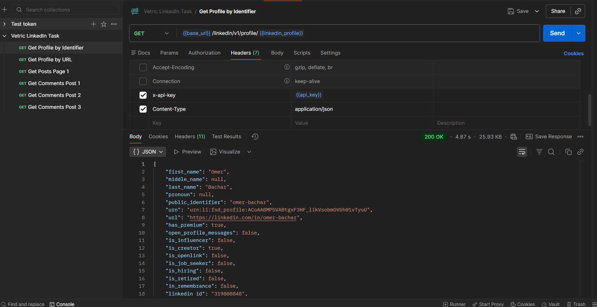
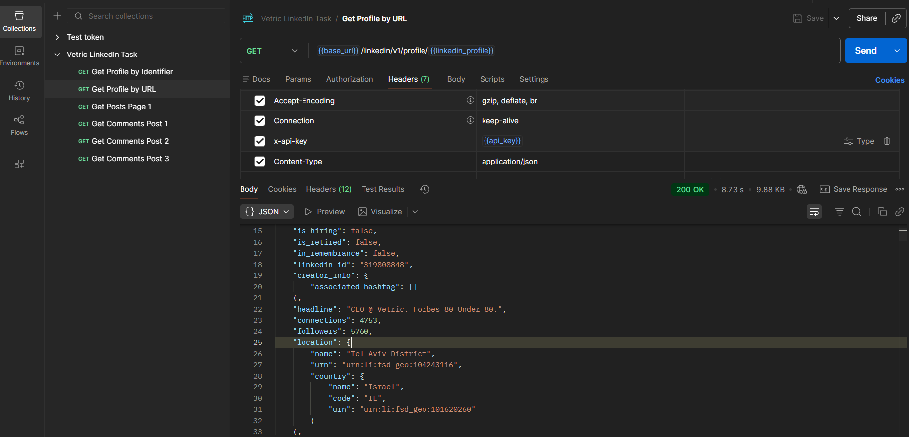
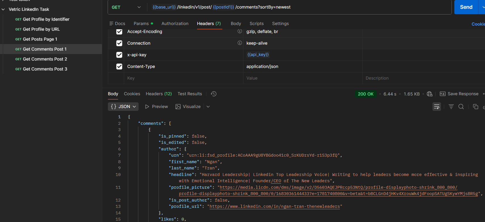

# Vetric LinkedIn API Integration

This project demonstrates REST API integration and testing using Postman and the Vetric LinkedIn API.

## Features

* Retrieve LinkedIn profile information
* Fetch user posts
* Retrieve post comments
* API key authentication
* JSON response analysis
* REST API request testing

## Technologies Used

* Postman
* REST APIs
* JSON
* API Authentication

## Skills Demonstrated

* API troubleshooting
* Request testing
* Query parameter handling
* JSON parsing
* API integrations
* Environment variables

## Project Structure

```txt id="jlwm200"
screenshots/
responses/
Vetric LinkedIn Task.postman_collection.json
README.md
```

## Screenshots

### Successful Profile Request



### API Authentication Headers



### Comments API Response



## How to Use

1. Import the Postman collection into Postman
2. Configure environment variables
3. Add your API key
4. Run the requests

## Notes

This project was created as part of a technical API integration assessment using Postman and REST APIs.
